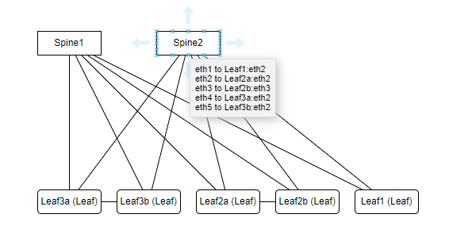

# Lab Topology Parser and Diagram Generator

This program is designed to parse a YAML configuration file that describes a network topology from ContainerLab, and generate a diagram in Draw.io XML format. The diagram identifies spines and leaf nodes based on the number of connections. You can view the used Ethernet ports by selecting a spine. 

## Features

- Parse a YAML file to extract topology information.
- Identify the number of connections for each node.
- Identify spine nodes based on connection thresholds.
- Generate a Draw.io diagram in XML format for visualizing the network topology.
- Save the diagram as a `.drawio` file, ready to be imported into Draw.io for editing and visualization.
- View the ethernet port used.

## Usage

### Command-line Flags

- `-f` : Specifies the YAML file containing the network topology. The default value is `exampleLab.yml`.

### Example Command

```bash
go run main.go -f yourLabFile.yml
```
```bash
./containerLabToDrawIO_linux_v1 -f yourLabFile.yml
```
```
Connection Count:
  Spine1: 5
  Spine2: 5
  Leaf2a: 3
  Leaf2b: 3
  Leaf3a: 3
  Leaf3b: 3
  Leaf1: 2
Spines Identified:
  Spine1
  Spine2
DrawIO diagram generated as 'diagram.drawio'
```

#### Result

